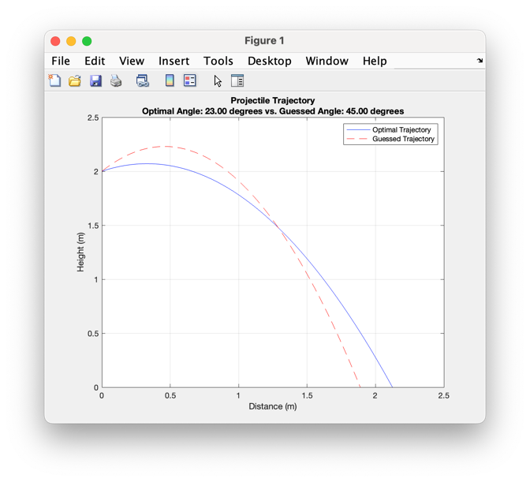

# Week 4 Homework Assignments: Program Design and File Import/Export

## Global Requirements

* All deliverables shall be added, committed, and pushed to your `Week4` folder in your repository.
* Include your name and the names of anyone who assisted you in the following format:

      % Student: Firstname Lastname
      % Assisted by: Firstname Lastname, etc.
* Ensure your **scripts** (**Not functions**) include the following to clear the workspace and command window

      clc;
      clear;
* All CSV files will generally be created by your program, this week, the only one provided is `gear_data.csv`
* There are tests for each assignment if, they are all functions, you may run them to confirm your functions perform as expected.
  * Be sure the test is in the same folder as your functions
* Outputs should resemble the examples shown however, they do not need to be exact, so long as sufficient data is there to resemble the example.

---

## 1. Optimizing Projectile Launch Angle

### Task

For this problem, you will create two MATLAB functions based on the code and concepts covered in the lecture. You will
also create a script that integrates both functions to compute and plot the trajectory of a projectile, while also
comparing a user’s guessed optimal launch angle with the computed optimal angle.

### Function 1: `calculateTrajectory`

Use the code from the lecture to create the function `calculateTrajectory`. Most of the code is provided, and minimal
changes are required.

**Requirements**:

- **Inputs**:
    - `v0`: Initial velocity in m/s (scalar)
    - `angle`: Launch angle in degrees (scalar)
    - `g`: Gravitational acceleration in m/s² (scalar)
    - `y0`: Initial height in meters (scalar)
    - `numValues`: Number of time intervals (scalar)

- **Outputs**:
    - `x`: Horizontal positions of the projectile (vector)
    - `y`: Vertical positions of the projectile (vector)
    - `time`: Time array used for computing positions (vector)

**Instructions**:

Write a MATLAB function named `calculateTrajectory` that takes the initial velocity (`v0`), launch angle (`angle`),
gravitational acceleration (`g`), initial height (`y0`), and the number of time intervals (`numValues`) as inputs. The function should return
the horizontal positions (`x`), vertical positions (`y`), and the time array (`time`) corresponding to the projectile's
motion.

Helper Equations:
$$ \text{total\_time} = \frac{v_y + \sqrt{v_y^2 + 2 \cdot g \cdot y_0}}{g} $$
$$ y = y_0 + v_y \cdot t - \frac{1}{2} \cdot g \cdot t^2 $$

### Function 2: `getOptimalTrajectoryAngle`

Create a new function called `getOptimalTrajectoryAngle` that computes the optimal launch angle and maximum range of a
projectile.

**Requirements**:

- **Inputs**:
    - `v0`: Initial velocity in m/s (scalar)
    - `y0`: Initial height in meters (scalar)
    - `gravity`: Gravitational acceleration in m/s² (scalar)

- **Outputs**:
    - `optimal_angle`: The launch angle (in degrees) that gives the maximum range (scalar)
    - `max_range`: The maximum range (in meters) at the optimal angle (scalar)

**Instructions**:

The function should test angles between 0 and 90 degrees at 1-degree increments and find the angle that results in
the maximum range using the provided projectile motion equations. For each angle, calculate the range of the
projectile, and track the angle that results in the maximum range.

Helper Equation:
$$ \text{range} = \frac{v_0 \cdot \cos(\theta)}{\text{gravity}} \cdot \left( v_0 \cdot \sin(\theta) + \sqrt{(v_0 \cdot \sin(\theta))^2 + 2 \cdot \text{gravity} \cdot y_0} \right) $$

### Script: `projectileComparison.m`

Create a MATLAB script that integrates both functions and allows the user to input values for the initial velocity,
initial height, and their guess for the optimal launch angle. The script will compute the optimal angle and compare it
to the user's guess, displaying both the optimal angle and the difference from the guessed angle. The script shall use
`9.81` to supply as the gravity value for each function.

**Requirements**:

1. **User Inputs**:
    - Prompt the user to input the initial velocity in m/s.
    - Prompt the user to input the initial height in meters.
    - Prompt the user to input their guess for the optimal angle in degrees.

2. **Manipulation**:
    - Use `getOptimalTrajectoryAngle()` to compute the optimal launch angle and maximum range based on the user inputs.
    - Use `calculateTrajectory()` to compute the projectile's trajectory for both the guessed angle and the optimal
      angle.

3. **Plotting**:
    - Plot both the trajectories, comparing them on the same plot.
    - The plot shall display:
        - One trajectory for the guessed angle
        - One for the optimal angle
        - (Do not worry about the line style or colors, MATLAB may show random values here)
        - **Note**: The plot should show the horizontal distance (x) on the X-axis and the vertical height (y) on the Y-axis, not time.

4. **Command Window Output**:
    - Display the optimal launch angle and maximum range in the command window.
    - Display how far off the user's guess was from the optimal angle in the command window.

### Example Interaction:

```
Enter the initial velocity (in m/s): 3
Enter the initial height (in meters): 2
Enter your guess for the optimal angle (in degrees): 45
```

### Example Output:

```
Optimal launch angle: 23.00 degrees
Maximum range: 2.12 meters
Your guess was off by 22.00 degrees.
```

### Example Plot:

The plot would display two trajectories:

* One for the optimal angle.
* One for the user-guessed angle, allowing the user to visually compare the two.

The plot shall include:

* X-axis: Distance (meters).
* Y-axis: Height (meters).
* A legend indicating the optimal angle and the user-defined angle as follows.
* (No need to match colors, or line styles, simply meet the above requirements).



### Testing

You can test your functionality running the following test files:

* `testCalculateTrajectory.m` tests `calculateTrajectory()`
* `testGetOptimalTrajectory.m` tests `getOptimalTrajectory()`
* `testProjectileComparisonAssignment.m` is an integration test, it tests that the scripts function together properly.

### Deliverables

1. Submit the script `projectileComparison.m`
2. Include comments explaining the calculation for the optimal angle and the range formula.
3. Submit the functions `calculateTrajectory.m` and `getOptimalTrajectory.m`

---

## 2. Gear Ratio Calculator with File Input/Output

### Task

For this problem, you will create a MATLAB function to calculate gear ratios and a script to process multiple gear pairs
from a CSV file. The script will calculate the gear ratio for each pair of gears and write the results to a new CSV file
with the gear ratios added as a new column.

### Function: `gearRatioCalc`

This function will compute the gear ratio for a given pair of gears.

**Requirements**:

- **Inputs**:
    - `driverTeeth`: Number of teeth on the driver gear (scalar)
    - `drivenTeeth`: Number of teeth on the driven gear (scalar)

- **Outputs**:
    - `gearRatio`: The gear ratio between the driver and driven gear (scalar)

**Instructions**:

Write a MATLAB function named `gearRatioCalc` that takes the number of teeth on the driver gear and the number of teeth
on the driven gear as inputs. The function should return the gear ratio, calculated as:

$$ \text{gearRatio} = \frac{\text{drivenTeeth}}{\text{driverTeeth}} $$

### Script: `processGearRatios.m`

Create a MATLAB script that reads a CSV file containing the number of teeth on the driver and driven gears for multiple
gear pairs. The script will use the `gearRatioCalc` function to calculate the gear ratio for each pair, add the results
as a new column to the CSV, and write the updated data to a new CSV file.

**Script Requirements**:

1. **File Input**:
    - Read a CSV file containing the number of teeth for multiple gear pairs.
    - The CSV file should have two columns: `driverTeeth` and `drivenTeeth`.
    - **Note**: The starter CSV file `gear_data.csv` is provided on the class GitHub page. However, an example is also below


   Example `gear_data.csv`:
    ```
    driverTeeth,drivenTeeth
    12,24
    15,30
    20,60
    ```

2. **Manipulation**:
    - For each pair of gear teeth, use `gearRatioCalc()` to compute the gear ratio.

3. **File Output**:
    - Add a new column called `gearRatio` to the CSV.
    - Write the updated data to a new file named `gear_ratios_output.csv`.

   Example output `gear_ratios_output.csv`:
    ```
    driverTeeth,drivenTeeth,gearRatio
    12,24,2.00
    15,30,2.00
    20,60,3.00
    ```

### Example CSV Interaction

Input CSV (`gear_data.csv`):

```
driverTeeth,drivenTeeth
12,24
15,30
20,60
```

Example output CSV (`gear_ratios_output.csv`):

```
driverTeeth,drivenTeeth,gearRatio
12,24,2.00
15,30,2.00
20,60,3.00
```

### Testing

You can test your functionality by running the following tests:

- `testGearRatioCalc.m` tests the `gearRatioCalc()` function with different gear pairs.
- `testProcessGearRatios.m` tests the `processGearRatios.m` script to ensure the CSV is processed correctly and the
  output file is generated.

### Deliverables

1. Submit the function `gearRatioCalc.m`.
2. Submit the script `processGearRatios.m`.
3. Include comments explaining how the input/output process is handled and how the gear ratio is calculated.
4. Ensure your program works for any number of rows in the CSV.

---

## 3. Kitchen Inventory Manager with Functions

### Task

For this assignment, you will build a simple kitchen inventory management system that stores ingredients in a CSV file.
The program will be divided into a script for handling user input/output, and three core
functions: `addItemToStock`, `getStockQty`, and `getInventoryList`. The inventory will store the `upc`, `ingredient`,
and `qty` (quantity) of each item.

### Script: `kitchenInventory.m`

The script will handle user input and call the appropriate functions to manipulate or display the inventory.

**Script Flow**:

1. **Main Menu**: Present a menu to the user with three options:
    - Add an ingredient.
    - Print the inventory list.
    - Check the quantity of an ingredient by UPC.
2. **Execute the Functionality**: Based on user input, call the appropriate function to handle each task.

### Function 1. `addItemToStock(filename, upc, ingredient, qty)`

This function adds a new item to the inventory file.

- **Inputs**:
    - `filename`: The name of the CSV file (e.g., `inventory.csv`).
    - `upc`: The UPC code of the item (string).
    - `ingredient`: The name of the ingredient (string).
    - `qty`: The quantity of the item (integer).

- **Output**: None. This function will append the new item to the inventory CSV file.

- **Instructions**: Write a function that opens the CSV file and appends the new row containing the `upc`, `ingredient`,
  and `qty`. If the file does not exist, it should create a new one with the appropriate headers.

### Function 2. `getStockQty(filename, upc)`

This function checks the quantity of a specific item in the inventory by its UPC.

- **Inputs**:
    - `filename`: The name of the CSV file (e.g., `inventory.csv`).
    - `upc`: The UPC code of the item to check (string).

- **Output**: The quantity of the item (integer), or `-1` if the UPC is not found.

- **Instructions**: The function should read the CSV file and return the quantity of the first matching item with the
  specified `upc`. If no match is found, return `-1`.

#### 3. `getInventoryList`

This function retrieves and returns the full inventory.

- **Inputs**:
    - `filename`: The name of the CSV file (e.g., `inventory.csv`).

- **Output**: A table containing the entire inventory list.

- **Instructions**: The function should read the CSV file and return the data as a table, which can be displayed
  using `disp()` in the main script.

### Example Script Interaction

The main script (`kitchenInventory.m`) will provide a menu with options for the user to add ingredients, check
quantities, or print the entire inventory list.

#### Sample Interaction

```
     ----------------------------------     
 | Welcome to the Kitchen Inventory Manager!
 |                                         
 | Please select an option:
 | 1. Add an ingredient
 | 2. Print inventory list
 | 3. Check ingredient quantity by UPC
 | 0. Exit
> 1
Enter the UPC: 123456
Enter the ingredient name: Tomato
Enter the quantity: 13
Ingredient added successfully.

     ----------------------------------     
 | Welcome to the Kitchen Inventory Manager!
 |                                         
 | Please select an option:
 | 1. Add an ingredient
 | 2. Print inventory list
 | 3. Check ingredient quantity by UPC
 | 0. Exit
> 3
Enter the UPC: 123456
UPC 123456 - Quantity: 13.00

     ----------------------------------     
 | Welcome to the Kitchen Inventory Manager!
 |                                         
 | Please select an option:
 | 1. Add an ingredient
 | 2. Print inventory list
 | 3. Check ingredient quantity by UPC
 | 0. Exit
> 2
Inventory List:
       upc        ingredient    qty
    __________    __________    ___

    1.2346e+05    {'Tomato'}    13 


     ----------------------------------     
 | Welcome to the Kitchen Inventory Manager!
 |                                         
 | Please select an option:
 | 1. Add an ingredient
 | 2. Print inventory list
 | 3. Check ingredient quantity by UPC
 | 0. Exit
> 0
Goodbye!
```

### Testing

You can test your functionality by running the following tests:

- `testAddItemToStock.m` tests the `addItemToStock()` function by ensuring that new items are added correctly to the CSV.
- `testGetStockQty.m` tests the `getStockQty()` function by validating that the correct quantity is retrieved for a given UPC.
- `testGetInventoryList.m` tests the `getInventoryList()` function by verifying that the entire inventory can be read and displayed properly from the CSV.

### Deliverables

1. Submit the script `kitchenInventory.m`.
2. Submit the functions `addItemToStock.m`, `getStockQty.m`, and `getInventoryList.m`.
3. Ensure your program handles input and output properly using the provided CSV file, and provide comments explaining
   each part of the code.

### Example `inventory.csv` (Provided on GitHub)

```csv
upc,ingredient,qty
123456789012,Tomato,5
987654321098,Onion,10
```

---

## Definition of Done

Your Week4 folder shall contain **at minimum**, the following files:

* Week4/
  * addItemToStock.m
  * calculateTrajectory.m
  * gearRatioCalc.m
  * getInventoryList.m
  * getOptimalTrajectoryAngle.m
  * getStockQty.m
  * kitchenInventory.m
  * processGearRatios.m
  * projectileComparison.m
