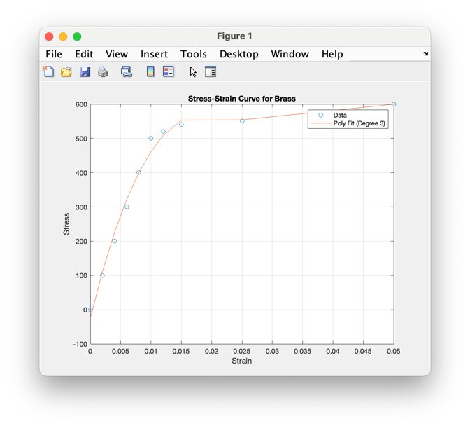
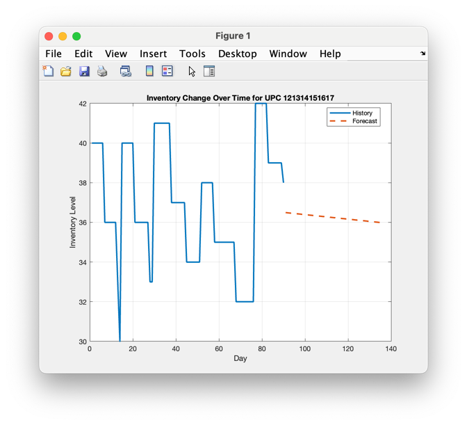
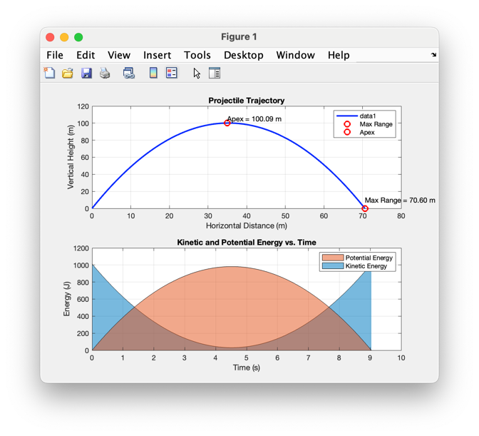

# Week 6 Homework Assignments: Advanced Functions and Plotting

## Global Requirements

- All deliverables shall be added, committed, and pushed to your `Week6` folder in your repository.
- Include your name and the names of anyone who assisted you in the following format:

      % Student: Firstname Lastname
      % Assisted by: Firstname Lastname, etc.

- Ensure your **scripts** (**Not functions**) include the following to clear the workspace and command window:

      clc;
      clear;
      close all;

- Provide comments explaining each part of your code.
- Use advanced function features such as optional parameters, subfunctions, and proper error handling.
- Make use of advanced plotting techniques to visualize data effectively.
- Ensure your programs handle input and output properly, and test them with different scenarios.

---

## 1. Stress-Strain Curve Fitting and Visualization

### Task

Create a MATLAB function and script that fit polynomial models to stress-strain data and visualize the results using
advanced plotting techniques.

### Function: `fitStressStrainCurve`

**Requirements**:

- **Inputs**:
    - `materialName`: Name of the material (string).
    - `degree` (optional): Degree of the polynomial for fitting (default is `2`).
    - `showPlot` (optional): Boolean to display the plot (default is `true`).

- **Outputs**:
    - `p`: Coefficients of the fitted polynomial.
    - `R_squared`: Coefficient of determination indicating the goodness of fit.

**Instructions**:

- Write a MATLAB function named `fitStressStrainCurve.m`.
- The function should:
    - Load stress-strain data from a CSV file named `materialName.csv`, which contains columns `Strain` and `Stress`.
    - Fit a polynomial of specified degree to the data using `polyfit` and `polyval`.
    - Calculate the R-squared value to assess the goodness of fit.
    - Use optional parameters to specify the degree of the polynomial and whether to display the plot.
    - Include error handling for file loading and invalid inputs.
    - Use advanced plotting techniques to display the original data and the fitted curve.

### Script: `stressStrainAnalyzer.m`

**Requirements**:

1. **User Inputs**:
    - Prompt the user to input the material name.
    - Prompt for the degree of the polynomial to fit.
    - Ask whether to display the plot.

2. **Manipulation**:
    - Call the `fitStressStrainCurve` function with the user inputs.

3. **Output**:
    - Display the polynomial coefficients and R-squared value.
    - If `showPlot` is `true`, display the plot.

### Example Interaction:

```
Please choose a material
  1. Steel
  2. Aluminum
  3. Brass
Enter a numeric input: 3
Enter the degree of the polynomial to fit: 3
Do you want to display the plot? (1 for Yes, 0 for No): 1
```

### Example Output:

```
Polynomial Coefficients:
   61.1683 -217.6748  155.7322  281.4437

R-squared Value: 0.9688
```

### Example Plot

The plot would display two datasets:

* One for the actual stress and strain curve.
* One for the best fit line.



### Data Files

Provide sample stress-strain data files with columns `Strain` and `Stress`. Example files:

- `Aluminum.csv`
- `Steel.csv`
- `Brass.csv`

### Testing

* `testFitStressStrainCurve.m` tests `fitStressStrainCurve()`

### Deliverables

- Submit the function `fitStressStrainCurve.m`.
- Submit the script `stressStrainAnalyzer.m`.
- Include sample data files in your `Week6` folder.
- Ensure your code is well-commented and uses advanced function features.

---

## 2. Inventory Forecasting Tool

### Task

Develop a MATLAB function and script that analyze inventory usage logs and predict future inventory levels for a specific ingredient. The forecast will help determine how long the current stock will last based on historical usage trends and provide a visual projection of future inventory levels.

### Function: `inventoryForecast`

**Requirements**:

- **Inputs**:
    - `upc`: UPC code of the ingredient (string or numeric).
    - `totalDays`: The number of days over which the inventory history is analyzed (integer).
    - `futureDays`: The number of days to forecast into the future (integer).
    - `inventoryFile`: CSV file containing the initial inventory data (e.g., `Inventory.csv`).
    - `usageFile`: CSV file containing the usage history (e.g., `UsageLog.csv`).

- **Outputs**:
    - `inventoryOverTime`: Vector representing inventory levels over the given time period (`totalDays`).
    - `y_future`: Predicted inventory levels for the forecasted period (`futureDays`).

**Instructions**:

- Write a MATLAB function named `inventoryForecast.m`.
- The function should:
    - Load the initial inventory data from `inventoryFile`, which contains columns `upc`, `ingredient`, `qty`.
    - Load the usage data from `usageFile`, which contains columns `day`, `upc`, `qty` (negative values for usage, positive for purchases).
    - Track inventory changes over the given time period (`totalDays`) based on usage and purchases from the log.
    - Forecast future inventory levels using a linear fit for the forecast period (`futureDays`).
    - Handle missing data or invalid inputs gracefully and return appropriate error messages.
    - Ensure the function works for multiple UPCs by allowing the user to select which ingredient to analyze.
    - **Note:** You will need to either convert the upc values in the table to string, use `fprintf`, or some other formatting method to avoid the scientific notation

### Script: `testInventoryForecast`

**Requirements**:

1. **Inputs**:
    - Prompt the user to input the UPC of the ingredient they would like to analyze.
    - Allow the user to specify the number of `futureDays` for analysis.
    - Total days can be left hard-coded to `90` given the limited data we have to work with.

2. **Manipulation**:
    - Call the `inventoryForecast` function with the user inputs.

3. **Output**:
    - Plot the historical inventory and future forecast on the same graph for easy interpretation.
    - If errors occur, handle them gracefully and inform the user.

**Plotting**:
- The plot should display:
    - **Inventory over time** for the actual data.
    - **Forecasted inventory** for the future period.
    - A clear legend indicating actual vs forecasted data.

### Data Files

Provide sample data files for testing and validation:

- **Inventory.csv**: Columns `upc`, `ingredient`, `qty` representing the initial stock for each ingredient.
- **UsageLog.csv**: Columns `day`, `upc`, `qty`, where negative values represent usage and positive values represent purchases.

### Example of Inventory Data (Inventory.csv):

```csv
upc,ingredient,qty
123456789012,Tomato,20
987654321098,Mayonnaise,5
111213141516,Flour,30
...
```

### Example of Usage Data (UsageLog.csv):

```csv
day,upc,qty
1,123456789012,-2
3,123456789012,-3
5,123456789012,5 
10,987654321098,-1
12,111213141516,-4
...
```

### Example Input:

```
Available ingredients for analysis:
         upc            ingredient  
    ______________    ______________

    "123456789012"    {'Tomato'    }
    "987654321098"    {'Mayonnaise'}
    "111213141516"    {'Flour'     }
    "121314151617"    {'Sugar'     }
    "131415161718"    {'Milk'      }
    "141516171819"    {'Eggs'      }
    "151617181920"    {'Butter'    }

Enter the UPC of the ingredient you want to analyze: 121314151617
How many days would you like to forecast? 45
```

### Example Plot:

The plot would display two datasets.

* One for the historical usage data
* One for the forecasted trend



### Testing

* Test the function with different UPCs to ensure that it correctly plots historical inventory levels and predicts future inventory changes.
* Test with different values for `futureDays` to ensure the forecast adapts correctly.
* Verify that the plot provides a clear, visual representation of the inventory and forecast.
* `testInventoryForecast.m` tests the `inventoryForecast()` function

### Deliverables

* Submit the function `inventoryForecast.m`.
* Submit the script `testInventoryForecast.m`.
* Include the sample data files `Inventory.csv` and `UsageLog.csv` in your submission folder.
* Ensure that your code is well-commented and uses advanced function features, such as error handling, plotting, and user inputs.

---

## 3. Projectile Motion with Key Points and Energy Analysis

### Task

Simulate the projectile motion of an object launched with a given initial velocity and angle. Plot the trajectory of the object and mark key points, such as the highest altitude and the maximum horizontal distance (range). Additionally, create a second plot that shows the kinetic and potential energy of the object over time using translucent area plots.

### Function: `projectileMotionWithKeyPoints`

**Requirements**:

- **Inputs**:
    - `v0`: Initial velocity (m/s).
    - `angle`: Launch angle (degrees).
    - `g`: Gravitational acceleration (m/s²).

- **Outputs**:
    - A plot showing the **trajectory** of the projectile.
    - Key points marked:
        - **Highest altitude (apex)**.
        - **Maximum range**.
    - A second plot showing **kinetic energy** and **potential energy** over time using translucent area plots.

**Instructions**:

1. Write a MATLAB function named `projectileMotionWithKeyPoints`.
2. The function should:
    - Calculate the projectile’s **trajectory** using the following equations:
        - Horizontal position over time:
          $$ x(t) = v_0 \cdot \cos(\theta) \cdot t $$
        - Vertical position over time:
          $$ y(t) = v_0 \cdot \sin(\theta) \cdot t - \frac{1}{2} \cdot g \cdot t^2 $$
    - Calculate the **time of flight** using:
      $$ t_{\text{flight}} = \frac{2 \cdot v_0 \cdot \sin(\theta)}{g} $$
    - Find the **apex** (highest altitude) using:
      $$ y_{\text{max}} = \frac{(v_0 \cdot \sin(\theta))^2}{2 \cdot g} $$
    - Calculate the **maximum range** using:
      $$ R = \frac{v_0^2 \cdot \sin(2\theta)}{g} $$
    - Create an area plot of the **kinetic energy** and **potential energy** over time:
        - Kinetic energy:
          $$ KE = \frac{1}{2} m v^2 = \frac{1}{2} m (v_x^2 + v_y^2) $$
        - Potential energy:
          $$ PE = m g h = m g y $$
3. Use the `FaceAlpha` property in MATLAB to make the area plots **translucent**.

### Script: `runProjectileMotion.m`

Create a matlab script that prompts the user for input and runs the `projectileMotionWithKeyPoints()` function with their inputs.

**Requirements**:

* **User Inputs**: 
  * Prompt the user to input the initial velocity in m/s.
  * Prompt the user to input the launch angle in degrees
  * Prompt the user to input the gravitational acceleration in m/s^2

### Example Input:

```
Enter the initial velocity (m/s): 45
Enter the launch angle (degrees): 80
Enter gravitational acceleration (m/s^2): 9.81
```

## Example Plot:

- The first plot should show the **trajectory** of the projectile, marking the apex and maximum range.
- The second plot should show the **kinetic energy** and **potential energy** over time with translucent area plots.



### Deliverables:

- Submit the function `projectileMotionWithKeyPoints.m`.
- Submit a script `runProjectileMotion.m` that prompts the user for input and calls `projectileMotionWithKeyPoints`.
- Ensure your code is well-commented and uses proper error handling.

### Definition of Done

Your `Week6` folder shall contain at minimum the following files:

* `projectileMotionWithKeyPoints.m`: The function that simulates the projectile motion and plots the results.
* `testProjectileMotion.m`: The script that prompts the user for input and calls the function.
* Any other scripts or functions you created or modified.


---

## Definition of Done

Your `Week6` folder shall contain at minimum the following files:

* `fitStressStrainCurve.m`
* `Inventory.csv`
* `inventoryForecast.m`
* `projectileMotionWithKeyPoints.m`
* `runInventoryForecast.m`
* `runProjectileMotion.m`
* `stressStrainAnalyzer.m`
* `UsageLog.csv`
* Any other functions or scripts you created or modified

